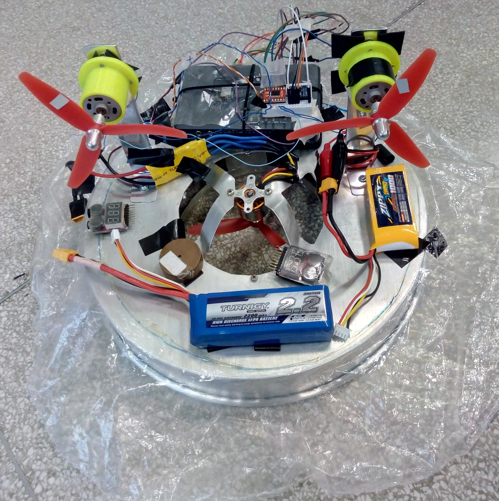

# Autonomous HoverCraft Prototype 

This repo shares the LabView code developed during my undergraduate research between 2018 and 2019. In the project, the prototype was improved in order to allow the implementation of a Nonlinear Controller based on State-Dependent Ricatti Equations (SDRE), as well as the validation of a novel dynamic modelling of a Hovercraft, developed in the Lab by a former graduate student of the Laboratory. The project isn't finished yet, there's a lot of work  to be done in order to validate and implement the controller. 

## Main Features 

- Communication through Wifi Network
- Integrated with IMU (accel / gyroscope)

## Materials (under construction)

- 1x myRIO embedded device
- 1x 2200KV brushless DC motor (for hovering effect)
- 2x DC Motors (for propulsion)
- 2x propellers 
- 1x ESC 30A
- 1x H-Bridge
- 2x LiPo Baterries
- 1x MPU6050 (IMU sensor)
- The prototype structure

## The Prototype

## The Hovercraft in action (controlled via LabView by a bad pilot)

## Future Work
- Implement sensor fusion (Kalman Filter)
- Integrate with GPS or SLAM system
- Validate automatic controller

## License

This project is released under the MIT License. Please review the [License file](LICENSE) for more details.
